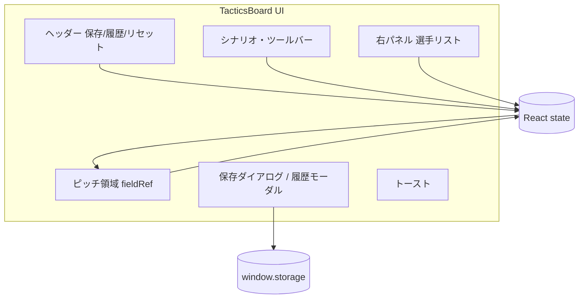

# 8人制フットボール作戦ボード — 設計書

## 1. 文書の目的

本書は `src/tactics-board_1.jsx` を中心とした実装の構造、データモデル、主要フロー、外部依存を記述する。`docs/要件定義書.md` の要件に対する設計対応を示す。

## 2. 技術スタック

| 層 | 技術 |
|----|------|
| 言語 | JavaScript (JSX) |
| UI ライブラリ | React 18（関数コンポーネント + Hooks） |
| スタイリング | Tailwind CSS（ユーティリティクラス）+ インライン `style` + `<style>` 埋め込み（`.tb-*` クラス） |
| アイコン | lucide-react |
| ビルド | Vite + @vitejs/plugin-react |
| 永続化（ブラウザ） | `src/storage-polyfill.js` による `window.storage` → `localStorage` マッピング |

## 3. ディレクトリ構成（抜粋）

```
Football_Tactics_Board/
├── index.html
├── package.json
├── vite.config.js
├── tailwind.config.js
├── postcss.config.js
├── src/
│   ├── main.jsx              # エントリ、StrictMode
│   ├── App.jsx               # TacticsBoard をマウント
│   ├── index.css             # Tailwind エントリ
│   ├── storage-polyfill.js   # window.storage 互換
│   └── tactics-board_1.jsx   # メイン UI・ロジック
├── docs/
│   ├── 要件定義書.md
│   └── 設計書.md             # 本書
└── claude.md
```

## 4. アーキテクチャ

単一の親コンポーネント `TacticsBoard` が状態を保持し、ピッチ・サイドパネル・モーダルを子要素として描画する。再利用可能な小コンポーネント（`ScenarioBtn`, `ToolBtn`, `Modal`, `SaveCard`, `SoccerBall` 等）は同一ファイル下部に定義されている。



## 5. 状態設計（主要 state）

| state | 型・内容 | 役割 |
|-------|-----------|------|
| `players` | 配列 | 全選手の位置・属性 |
| `hidden` | `Set` of id | ボード非表示の選手 |
| `zoom` | `'full' \| 'home' \| 'away'` | ビューポートモード |
| `tool` | `'move' \| 'arrow'` | 操作ツール |
| `arrowKind` | `'pass' \| 'run'` | 矢印の意味 |
| `arrows` | 配列 `{ id, from, to, kind }` | 確定済み矢印 |
| `drawing` | オブジェクト or null | 描画中の一時矢印 |
| `dragId` | string or null | ドラッグ中の選手 id |
| `ball` | `{ x, y }` | ボール論理座標 |
| `saves` | 配列 | 保存レコード一覧（メモリ） |
| `showSaveDialog` / `showLibrary` | boolean | モーダル表示 |
| `toast` | `{ msg, type }` or null | 通知 |

## 6. 座標系とビューポート

- ワールド座標は矩形 `[0, PITCH_W] × [0, PITCH_H]`（`PITCH_W=50`, `PITCH_H=68`）。
- `zoom` に応じて表示矩形 `vb = { x, y, w, h }` を切り替え、`viewBox` とパーセント位置計算 `worldToPct` に反映する。
- クリック／ドラッグ位置は `fieldRef` の `getBoundingClientRect` から正規化し、`getWorldFromEvent` でワールド座標に変換。クリップしてピッチ外に出さない。

## 7. インタラクション設計

### 7.1 選手ドラッグ

- `onPointerDown` で `setPointerCapture`、`dragId` 設定、`selectedId` 更新。
- `onPointerMove` で該当選手の `x`,`y` を更新。
- `onPointerUp` / `Cancel` でキャプチャ解放。

### 7.2 ボール

- 選手と同様の Pointer モデル。`ballDragging` で移動中を区別。

### 7.3 矢印

- フィールドの `onPointerDown` で `drawing` 開始（ツールが arrow のとき）。
- `onPointerMove` で `to` を更新。
- `onPointerUp` でベクトル長がしきい値超なら `arrows` に append。

### 7.4 写真アップロード

- 非表示 `<input type="file" accept="image/*">` を ref で操作。
- `pendingPhotoIdRef` で対象選手を保持。`FileReader` + `Image` + `canvas` でリサイズし Data URL 化。

## 8. 永続化 API（`window.storage`）

アプリは次の非同期インターフェースを前提とする。

| メソッド | 引数 | 戻り値 | 用途 |
|----------|------|--------|------|
| `list(prefix)` | プレフィックス文字列 | `{ keys: string[] }` | `save:` で始まるキー列挙 |
| `get(key)` | キー | `{ value: string }` or null | JSON 文字列の取得 |
| `set(key, value)` | キー, 文字列 | — | JSON 保存 |
| `delete(key)` | キー | — | 削除 |

キー例: `save:${id}`。レコード JSON の主要フィールド: `id`, `name`, `note`, `timestamp`, `players`, `hidden`, `arrows`, `zoom`, `ball`。

**ポリフィル**: `src/storage-polyfill.js` は論理キーを `localStorage` 上では `ftb_storage:` プレフィックス付きで保存し、`list` のプレフィックス一致は論理キー側で判定する。

## 9. プリセットシナリオ（ロジック概要）

- **defenseScenario**: `zoom = home`、特定 away id を `hidden` に追加、一部 away の座標を前方寄りに上書き、`arrows` クリア。
- **offenseScenario**: `zoom = away`、特定 home id を非表示、MF/FW の座標を敵陣側に上書き、`arrows` クリア。
- **showAll**: 非表示解除 + 全体表示。

## 10. コンポーネント分割（同一ファイル内）

| 名前 | 責務 |
|------|------|
| `TacticsBoard` | 全体状態・メインレイアウト |
| `ScenarioBtn` / `ToolBtn` / `ArrowTypeBtn` | ツールバー用トグルボタン |
| `TeamTab` | サイドパネルタブ |
| `IconBtn` | 小アイコンボタン |
| `LegendItem` | 凡例行 |
| `SoccerBall` | ボール SVG |
| `Modal` | オーバーレイ + Escape 閉じる |
| `SaveCard` | 履歴1件のミニピッチプレビューと操作 |

## 11. スタイル方針

- クラブカラー定数（`NAVY_*`, `GOLD_*`, `HOME_COLOR` 等）を JS 定数として保持し、インライン style と `<style>` ブロックで参照。
- Tailwind はレイアウト・余白・タイポの補助に使用。

## 12. 今後の拡張ポイント（参考）

- `window.storage` の実装をネイティブ層に差し替え（オフライン容量拡張など）。
- 選手数・フォーメーションの設定ファイル化。
- 画像を Data URL ではなく IndexedDB / Blob URL で保持し保存サイズを削減。

## 13. 改訂履歴

| 日付 | 版 | 内容 |
|------|-----|------|
| 2026-04-23 | 1.0 | 初版 |
